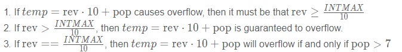
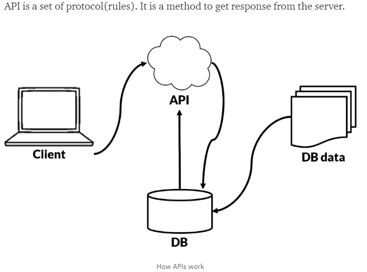

# 1st week ARTS
## Algorithm
### 1.[Sum All Numbers in a Range]
https://forum.freecodecamp.org/t/freecodecamp-algorithm-challenge-guide-sum-all-numbers-in-a-range/16083

Problem Explanation:

You need to create a program that will take an array of two numbers who are notnecessarily in order, and then add not just those numbers but any numbers in between. For example, [3,1] will be the same as 1+2+3 and not just 3+1

先审题，一个数组包含两个不同的整型数据，要返回从小的值到大的值（包含这两个元素）之间的所有值的和。第一想法是用一个for循环，用 Math.max（arr）和Math.min（）获得最大最小值，然后来看了中级解法发现可以结合着数学公式 累加结果=加的个数x（最大值+最小值）/2 即数量*平均值来做。高级解法用了扩展运算符（... arr）允许将实际数组传递给函数而不是逐个元素，这个之前没用到过，涨了知识。

#### BasicCode Solution:
```java
function sumAll(arr) {
var max = Math.max(arr[0], arr[1]);
var min = Math.min(arr[0], arr[1]);
    var temp = 0;
for (var i=min; i <= max; i++){
    temp += i;
}
return(temp);
}

sumAll([1, 4]);//test
```

Code Explanation:

1.First create a variable to store the max number between two.
2.The same as before for the Smallest number.
3.We create a temporary variable to add the numbers.

Since the numbers might not be always in order,using max() and min() will help organize.


#### Intermediate Code Solution:
```java
function sumAll(arr) {
  // Buckle up everything to one!

  // Using ES6 arrow function (one-liner)
  var sortedArr = arr.sort((a,b) => a-b);
  var firstNum = arr[0];
  var lastNum = arr[1];
  // Using Arithmetic Progression summing formula

  var sum = (lastNum - firstNum + 1) * (firstNum + lastNum) / 2;
//这里用了数学公式 结果=数量*平均值
  return sum;
}
```
Code Explanation:

1.Firstly, we create a variable called sortedArr which sorts it from the lowest to the highest value.

2.firstNum is equal to the first number and lastNum is equal to the second number.Next, using the Arithmetic Progression summing formula we let sum equal (lastNum-firstNum + 1) * (firstNum + lastNum) / 2.

3.Finally, we return sum.

The line var sortedArr = arr.sort((a,b) => a-b); is probably what will have you more confused. This would be the same as creating a function that returns a-b for the sort() which is the standard way to sort numbers from smallest to largest. Instead using arrow or fat arrow function, we are able to do all that in one single line thus allowing us to write less.

#### Advanced Code Solution:
```java
function sumAll(arr) {
    var sum = 0;
    for (var i = Math.min(...arr); i <= Math.max(...arr); i++){
        sum += i;
    }
  return sum;
}
```
Code Explanation:

Creating a variable sum to store the sum of the elements.
Starting iteration of the loop from min element of given array and stopping when it reaches the max element.
Using a spread operator (…arr) allows passing the actual array to the functioninstead of one-by-one elements.

总结一下这种一重循环的优化的地方感觉比较少了，印象中这种情况优化多数在利用数学公式和利用抑或这种逻辑判断还有递归这种，或者是一些不可通用的方法。

### 2.[Reverse Integer]
https://leetcode.com/problems/reverse-integer/description/

Problem Explanation:

Given a 32-bit signed integer, reverse digits of an integer.
Assume we are dealing with an environment which could only store integers within the 32-bit signed integer range: [−231,  231 − 1]. For the purpose of this problem,assume that your function returns 0 when the reversed integer overflows.

*Solution:*
Approach 1: Pop and Push Digits & Check before Overflow

Intuition

We can build up the reverse integer one digit at a time. While doing so, we can check beforehand whether or not appending another digit would cause overflow.

Algorithm

Reversing an integer can be done similarly to reversing a string.
We want to repeatedly "pop" the last digit off of x and "push" it to the back of the rev In the end,rev will be the reverse of the x. to "pop" and "push" digits without the help of some auxiliary stack/array, we can use math.

```java
//pop operation:
pop = x % 10;
x /= 10;
//push operation:
temp = rev * 10 + pop;
rev = temp;
```
However, this approach is dangerous, because the statement temp=rev*10+pop cancause overflow.

Luckily, it is easy to check beforehand whether or this statement would cause an overflow.



Similar logic can be applied when rev is negative.

```java
class Solution {
    public int reverse(int x) {
        int rev = 0;
        while (x != 0) {
            int pop = x % 10;
            x /= 10;
            if (rev > Integer.MAX_VALUE/10 || (rev == Integer.MAX_VALUE / 10 && pop > 7)) return 0;
            if (rev < Integer.MIN_VALUE/10 || (rev == Integer.MIN_VALUE / 10 && pop < -8)) return 0;
            rev = rev * 10 + pop;
        }
        return rev;
    }
}
```
Complexity Analysis

Time Complexity: O(log(x)). There are roughly lnx digits in x.
Space Complexity: O(1).

My solution:
```java
class Solution {
  public int reverse(int x) {
        long result=0;
        while(x!=0)
        {
            int mod = x%10;
            result = result * 10 + mod;
            if(result > 0x7fffffff || result < -0x7fffffff)
            {
                result = 0 ;
                break;
            }
            x= x/10;
        }
        return (int)result;
    }
}
```

## Review
### 1.Rest API Calls Made Easy

https://blog.yellowant.com/rest-api-calls-made-easy-7e620e4d3e82

这篇文章是在medium上看到的，碰巧自己昨天有想过API的问题于是来看。自己之前看英文原版文章很少，因此比较费劲，而且对API的了解不是很深，所以先去大概了解了一下API。回过头来看感觉这篇文章没有什么太大的价值，只是介绍了一下Rest API的使用规范。不过也是有收获的。刚接触所以可能很多方面不严谨甚至有错，欢迎大家指出和建议。

#### 1.以下是我对API的了解过程：
What is API?--自己的理解是 API是客户端与服务器交互的一个媒介。这里的客户端和服务器都是相对应而言的，发出请求的一方都可以被看成是客户端，而响应并操作的看成服务器。API负责记录客户端的请求，发送给服务器并告知需求，服务器接收请求并给出响应，API再返回响应的结果给客户端。



一个生活中常见的例子来形象化API：

顾客进入餐厅填写菜单（调用2号API）-写完交给服务员（1号API）-服务员（1号API）将按照菜单（2号API）的需求和内容告知厨房-厨房了解并且做好相应的菜-服务员（1号API）按照菜单（2号API）给顾客上菜

更贴近实际API的例子：
当我们搜索航班是否在线，在一家专门的航空公司官网上选择出发时间和去的城市等信息，航空公司的网站会按照这些信息，通过专门的API搜索数据库是否有满足条件的数据并返回消息。

另外一种方式，在一个集合了多家航空公司的app上搜索是否可以订购座位。app会与各个航空公司进行互动，查看是否有合适的座位，他们之间也有API，而且每家航空公司对应一个不同的API以方便区分。

总结，API就像一个来回奔跑与应用程序数据库和设备之间的waiter 提供数据并创造连接

API的好处：

1.更加安全，我们需要一个API，来保证不是所有东西都可以进入（盒子），只有满足要求的才可以进入。

2.API规定了格式，标准，因此大家使用更加统一，高效，规范。

3.对彼此的隐私更友好，客户端和服务器彼此之间不需要知道对方太多的东西，只需要发出需求或者根据接收到的需求做出相应的反应即可。

4.我们不需要知道内部是怎么实现的，只需要按照API去做我擅长做的事情就可以，这简直太棒了。

#### 2.这篇文章的重点

API包含了6个参数

-API end point*

-Method*

-Rest Endpoint*

-Headers*

-Params

-Data(Payload)

作者在文中用了列表消息和发送电子邮件这两个功能来展示，具体内容不详细展开，有需要的可以访问原文，链接在前面已经给出。

## Tip
​最近在学前端方面的知识，很多零碎的知识。这里提几个我在做静态网页时碰到的觉得有用的知识。

1.原本想要用户在文本框中输入内容，在输入回车的时候接收用户输入的内容并做出相应的反应，用keyCode==13来判断用户输入的是否为回车。但是实际情况输入回车后不行，设置为其他的按键则没有这样的问题。后来发现在form表单下创建文本框情况下，在文本框里输入回车键会默认提交表单，解决办法就是不要用form改成div，或者不用回车作为判断依据。

2.Bootstrap用到了栅格系统做到了响应式布局，支持在不同屏幕下的不同效果，将系统自动分成12列，这是它核心所在。

3.在学习JS JQuery Bootstrap等等的过程中，我发现有很多的组件，插件，工具，网上还有很多人写好可以直接拿来用的东西。刚开始觉得用多了这些快捷的工具不好，会让人逐渐忘记原本的东西。后来和人交流，觉得自己不能封闭，要学会拥抱这些。在日常可以一点点提升自己的段位，慢慢了解底层是怎么实现的，别人是通过什么方式做到的。在实际工作中每个人水平不同，为了使得整个项目走得快稳不出错，使用网上已经封装好并且很多人用的工具是快捷有效的方式。技术在发展，不断有新的东西出现，要去接触并且判断什么是好的什么是坏的。先使用，用熟练并且觉得很好用可以去看看别人是怎么实现的，这种方式能不能用在其他方面，有没有什么可以改进的地方等等。

## Share
### How to make the perfect Singleton?

https://medium.com/exploring-code/how-to-make-the-perfect-singleton-de6b951dfdb0

这篇文章是看到 @好沉 haoyongchen 在自己的ARTS上分享的，非常棒！说的单例模式可能存在的问题以及如何尽可能使我们创建的单例模式完美。

What is Singleton?单例模式是一种设计模式，其核心是Restrict the instantiation of a class and ensures that only one instance of the class exists in the java virtual machine.即限制类的实例化并确保java虚拟机中只存在一个类的实例。

Why we need it?这样做的好处很明显是在需要控制资源的地方可以很有效地使用，例如database connections和sockets.

How to create it? 有两种方式，饿汉式（实例在类加载时实例就被创建）和懒汉式（客户端真正需要用到实例，在getInstance()方法里创建的）。作者还通过hashCode来验证了通过单例模式创建的对象在java虚拟机的确是一个。尽可能使用懒汉式，防止内存泄漏。

The possible problems and solutions:

1.单例模式的创建。上面说到的内存泄漏。

  Solution:通过懒汉式创建

2.反射，如果通过反射修改构造函数为public则可能会获得不同的对象实例。

  Solution:在构造函数中抛出异常。

3.线程安全

  Solution:对getInstance()加synchronized关键字。但是有两个缺点，第一就是上锁的开销比较大,第二就是锁的粒度过大。
  Better solution：采用double-check的方式来解决粒度过大的问题，也就是当检查到null的时候再上锁，上锁之后为了检查是否和上锁之前状态一致，再检查是否是null。

4.序列化和反序列化，反序列化后获得的单例对象可能不一致

  solution：通过实现readResolve()方法来解决

下面是代码：
```java
public class SingletonClass implements Serializable {

    private static volatile SingletonClass sSoleInstance;

    //private constructor.
    private SingletonClass(){

        //Prevent form the reflection api.
        if (sSoleInstance != null){
            throw new RuntimeException("Use getInstance() method to get the single instance of this class.");
        }
    }

    public static SingletonClass getInstance() {
        if (sSoleInstance == null) { //if there is no instance available... create new one
            synchronized (SingletonClass.class) {
                if (sSoleInstance == null) sSoleInstance = new SingletonClass();
            }
        }

        return sSoleInstance;
    }

    //Make singleton from serialize and deserialize operation.
    protected SingletonClass readResolve() {
        return getInstance();
    }
}
```
