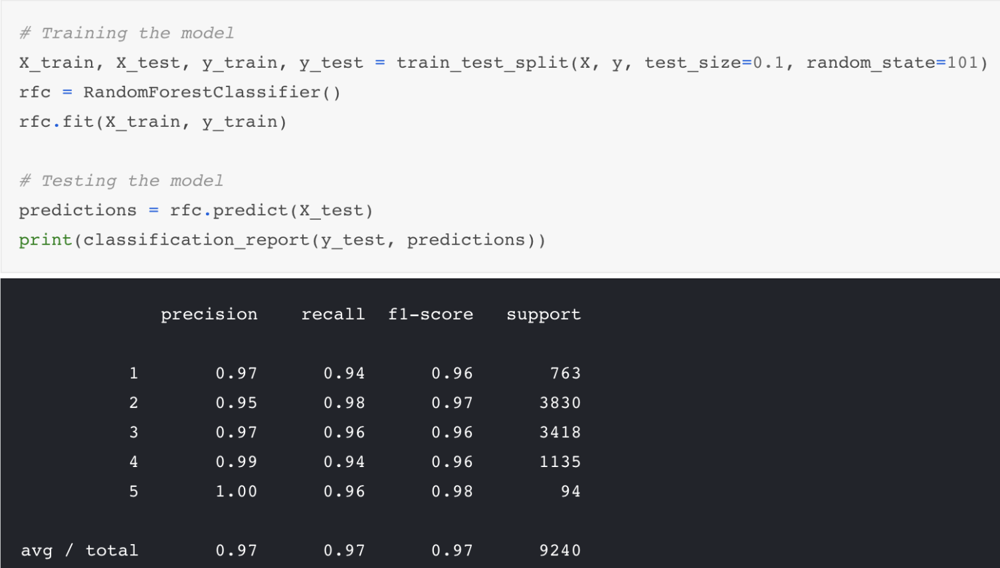

# 2st week ARTS
## Algorithm
### [Palindrome Number](https://leetcode.com/problems/palindrome-number/description/)
Problem Explanation:
Determine whether an integer is a palindrome. An integer is a palindrome when it reads the same backward as forward.

#### Intuition:
1.  The first idea that comes to mind is to convert the number into string, and check if the string is a palindrome, but this would require extra non-constant space for creating the string.
2. Second idea would be reverting the number itself, and then compare the number with original number, if they are the same, then the number is a palindrome. However, if the reversed number is larger than int.MAX, we will hit integer overflow problem.
3. Following the thoughts based on the second idea, to avoid the overflow issue of the reverted number, what if we only revert half of the int number? After all, the reverse of the last half of the palindrome should be the same as the first half of the number, if the number is a palindrome.

For example, if the input is 1221, if we can revert the last part of the number "1221" from "21" to "12", and compare it with the first half of the number "12", since 12 is the same as 12, we know that the number is a

#### Algorithm

First of all we should take care of some edge cases. All negative numbers are not palindrome, for example: -123 is not a palindrome since the '-' does not equal to '3'. So we can return false for all negative numbers.

Now let's think about how to revert the last half of the number. For number 1221, if we do 1221 % 10, we get the last digit 1, to get the second to the last digit, we need to remove the last digit from 1221, we could do so by dividing it by 10, 1221 / 10 = 122. Then we can get the last digit again by doing a modulus by 10, 122 % 10 = 2, and if we multiply the last digit by 10 and add the second last digit, 1 * 10 + 2 = 12, it gives us the reverted number we want. Continuing this process would give us the reverted number with more digits.

Now the question is, how do we know that we've reached the half of the number?
 **Since we divided the number by 10, and multiplied the reversed number by 10, when the original number is less than the reversed number, it means we've processed half of the number digits.**

```C
public class Solution {
    public bool IsPalindrome(int x) {
        // Special cases:
        // As discussed above, when x < 0, x is not a palindrome.
        // Also if the last digit of the number is 0, in order to be a palindrome,
        // the first digit of the number also needs to be 0.
        // Only 0 satisfy this property.
        if(x < 0 || (x % 10 == 0 && x != 0)) {
            return false;
        }

        int revertedNumber = 0;
        while(x > revertedNumber) {
            revertedNumber = revertedNumber * 10 + x % 10;
            x /= 10;
        }

        // When the length is an odd number, we can get rid of the middle digit by revertedNumber/10
        // For example when the input is 12321, at the end of the while loop we get x = 12, revertedNumber = 123,
        // since the middle digit doesn't matter in palidrome(it will always equal to itself), we can simply get rid of it.
        return x == revertedNumber || x == revertedNumber/10;
    }
}

```
Complexity Analysis

Time complexity : $O(log_{10}(n))$
. We divided the input by 10 for every iteration, so the time complexity is $O(log_{10}(n))$
Space complexity : $O(1)$.


 My solution:

```java
class Solution {
    public boolean isPalindrome(int x) {
    if(x<0 || (x!=0 && x%10==0)){
         return false;
    }


    int res = 0;
       while(x>res){
        res = res*10 + x%10;
        x = x/10;
       }
    return (x==res || x==res/10);
}

}

```

#### Conclusion
Optimize code structure
1. solve it without conversion
2. reduce the times of comparisons or loop
3. edge cases can be excluded at the beginning

## Review
### 1. [Wine Ratings Prediction using Machine Learning](https://towardsdatascience.com/wine-ratings-prediction-using-machine-learning-ce259832b321)
This article is an experiment on a real life example by author who is a beginner of ML.He wants to through machine learning, to predict a wine rating (in point) based on its description.
Here are a few steps from the author's experiment:
1. Get the dataset and remove duplicates and NaN values
2. Simplify the model with 5 different values
3. Vectorization--One of the simplest method to classify texts with ML  
He chooses the TF-IDF Vectorizer:the weight increases proportionally to count, but is offset by the frequency of the word in the total corpus. This is called the IDF (Inverse Document Frequency). This allows the Vectorizer to adjust weights with frequent words like “the”, “a” etc…
4. Training and testing the model:Train your model with a percentage of your dataset, and then test its accuracy by comparing the remaining of your dataset with the predictions.
The classifier we’ll be using is a RandomForestClassifier (RFC), because it’s cool and it works well in a lot of situations.
5. Get the results:

97% of the time we were able to predict correctly the quality of a wine based only on its description.
End note:
        **We can get more kinds of dataset.**
        **Maybe with a larger dataset a Multinomial Naive Bayes would be as good and more performant.**
        **We could binarize / encode them to be classified.**

Many times we would feel that learning knowledge is boring. Maybe we can try to experiment on a real life example. It always worked better when the subject is something that passionates us.


## Tip
### 1.atom
 上周之前我没有编写过MarkDown格式的文件，GitHub也用的不多，习惯性用了WPS写的文章上传。看大家发的ARTS链接都是直接点进去就可以看的，观察了下发现格式不一样，然后去了解了一下MarkDown格式并下载了atom来使用，花了半天的时间大概摸索出来如何使用，第一次写ARTS费了很大功夫。这次好了很多，下面写一些我在使用过程中遇到的问题和解决办法以及技巧。
 1. 插件：[使用Atom打造无懈可击的Markdown编辑器](http://www.cnblogs.com/fanzhidongyzby/p/6637084.html) 上介绍的几个插件基本够用了
   尤其是markdown-preview-plus 可以预览实时渲染+同步滚动（plus自带滚动不用下markdown-scroll-sync），编写数学公式。
 2. 插入和调整图片：不得不说markdown在插入图片这方面实在是反人类（其他方面都很棒）我需要先把图片保存再按照的格式来插入，还需要写路径，本地路径更改图片地址或者删除本地图片好像会出错，所以地址最好写网上的图片地址，没有网上链接地址的好像可以通过微博的一个功能生成外链，太繁琐了我连试都没有试。好在有插件可以用，markdown-image-paste插件看网上很多人推荐，不过我没有使用成功，不知道是不是我个人原因。不过如果你跟我一样不能使用这款插件，我推荐你使用markdown-imagine-assistant,它不仅可以通过直接拖拽图片的方式在文档中生成图片，而且还可以html格式显示，这刚好解决了我在图片上的第二个问题——排版。现在我可以直接直接拖拽图片生成html，然后顺手更改width，height，margin-left等样式来控制图片大小位置,而且可以用p标签使得两张图片放在一行（我上个ARTS就需要这种情况）。拖拽的图片会默认保存在一个assets文件包中,这也很方便。
 ——后来使用过程中atom右下角出现一个deprecation，不过作者给出了[解决方案](https://github.com/tlnagy/atom-markdown-image-assistant/commit/57330e3d55cdd31941ad790a51b9ed7ba432d245)。更改一行代码就解决了。

    7月5日修改：在群里和大家讨论了一下，发现自己想法的不足之处。立即反思并记录下来。
    1.图片大小的问题。当初看到插入图片的官方格式觉得很烦，虽然知道可以修改宽度等格式，但下意识觉得也很烦，快速找到了看似方便快捷的解决途径（我对html语法很熟悉，所以看到自动生成html语句很开心，根本没有去了解其他的）后来群里伙伴贴了他的方法，我才知道原来这也很方便快捷。
    2.是把图片放到网上生成外链再插入文档好，还是直接放好？这个问题根据不同人需求答案也不同。我当初以为我用的插件是通过把我拖拽的图片生成连接放在网上，然后还保存到本地，因此觉得比较好。后来证明自己太naive了，那只是放在了同文档的一个路径下，不过简便了几步操作。但简便操作的弊端是我上传GitHub也需要将图片文件夹一同上传，这刚好变成了我讨厌的场景。而当初写文档的目的是为了1.提高自己思维能力。2.锻炼自己写作能力。3.与人分享讨论。插入的图片源文件基本不会再用到，因此我之后都会采用生成外链的方式插入图片。
    3.现在使用atom发现在英文切换中文输入法时会卡且常常失败，不知道是不是对中文的支持有问题。

## Share
1. This is my second time to write ARTS and this time is better than the last a lot.I try to use english to write it in most situation although my english is poor.The time I spent on it is less than the last but the quality is the same and I'll try to do better.
2. the differences between Response.sendredirect and RequestDispatcher.forward

  * RequestDispatcher.forward 方法只能将请求转发给同一个WEB应用中的组件；而HttpServletResponse.sendRedirect 方法不仅可以重定向到当前应用程序中的其他资源，还可以重定向到同一个站点上的其他应用程序中的资源，甚至是使用绝对URL重定向到其他站点的资源。如果 传递给HttpServletResponse.sendRedirect 方法的相对URL以“/”开头，它是相对于整个WEB站点的根目录；如果创建RequestDispatcher 对象时指定的相对URL以“/”开头，它是相对于当前WEB应用程序的根目录。

  * 调用HttpServletResponse.sendRedirect 方法重定向的访问过程结束后，浏览器地址栏中显示的URL会发生改变，由初始的URL地址变成重定向的目标URL；而调用 RequestDispatcher.forward 方法的请求转发过程结束后，浏览器地址栏保持初始的URL地址不变。

  * HttpServletResponse.sendRedirect 方法对浏览器的请求直接作出响应，响应的结果就是告诉浏览器去重新发出对另外一个URL的访问请求。
  举个例子：重定向过程好比有个绰号叫“浏览器”的人写信找张三借钱，张三回信说没有钱，让“浏览器”去找李四借，并将李四现在的通信地址告诉给了“浏览器 ”。于是，“浏览器”又按张三提供通信地址给李四写信借钱，李四收到信后就把钱汇给了“浏览器”。可见，“浏览器”一共发出了两封信和收到了两次回复，“ 浏览器”也知道他借到的钱出自李四之手。 RequestDispatcher.forward 方法在服务器端内部将请求转发给另外一个资源，浏览器只知道发出了请求并得到了响应结果，并不知道在服务器程序内部发生了转发行为。这个过程好比绰号叫“ 浏览器”的人写信找张三借钱，张三没有钱，于是张三找李四借了一些钱，甚至还可以加上自己的一些钱，然后再将这些钱汇给了“浏览器”。可见，“浏览器”只 发出了一封信和收到了一次回复，他只知道从张三那里借到了钱，并不知道有一部分钱出自李四之手。

  * RequestDispatcher.forward 方法的调用者与被调用者之间共享相同的request 对象和response 对象，它们属于同一个访问请求和响应过程；而HttpServletResponse.sendRedirect 方法调用者与被调用者使用各自的request 对象和response 对象，它们属于两个独立的访问请求和响应过程。
  对于同一个WEB应用程序的内部资源之间的跳转，特别是跳转之前要对请求进行一些前期预处理，并要使用 HttpServletRequest.setAttribute 方法传递预处理结果，那就应该使用RequestDispatcher.forward 方法。
  不同WEB应用程序之间的重定向，特别是要重定向到另外一个WEB站点上的资源的情况，都应该使HttpServletResponse.sendRedirect 方法。

  * 无论是RequestDispatcher.forward 方法，还是HttpServletResponse.sendRedirect 方法，在调用它们之前，都不能有内容已经被实际输出到了客户端。如果缓冲区中已经有了一些内容，这些内容将被从缓冲区中清除。
